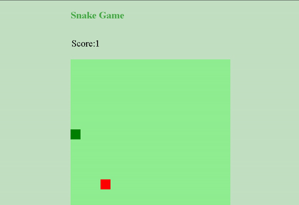

<h1 align="center">Snake Game</h1>

Olá! Esse é um projeto de um curso da DIO. É um jogo com uma temática bem simples, no qual a lógica foi feita por JavaScript.
 

  

   
   

### 🛠 Tecnologias

- [JavaScript](https://developer.mozilla.org/pt-BR/)
- [HTML](https://www.w3.org)
- [CSS](https://www.w3.org/Style/CSS/Overview.en.html)
